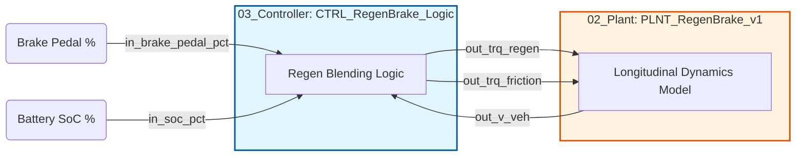
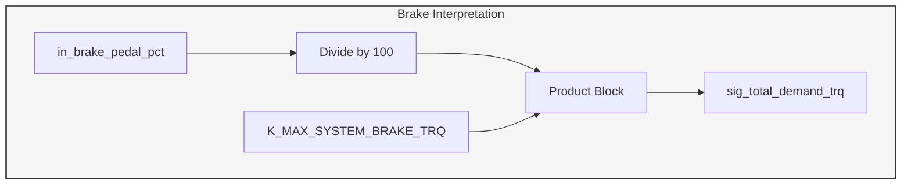
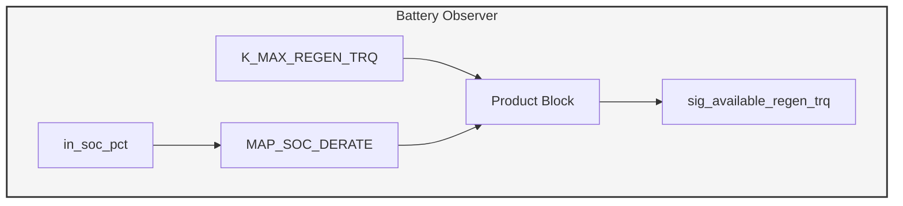
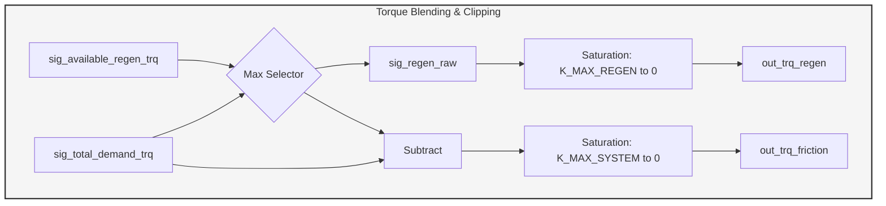
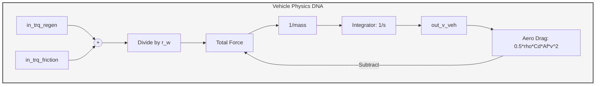
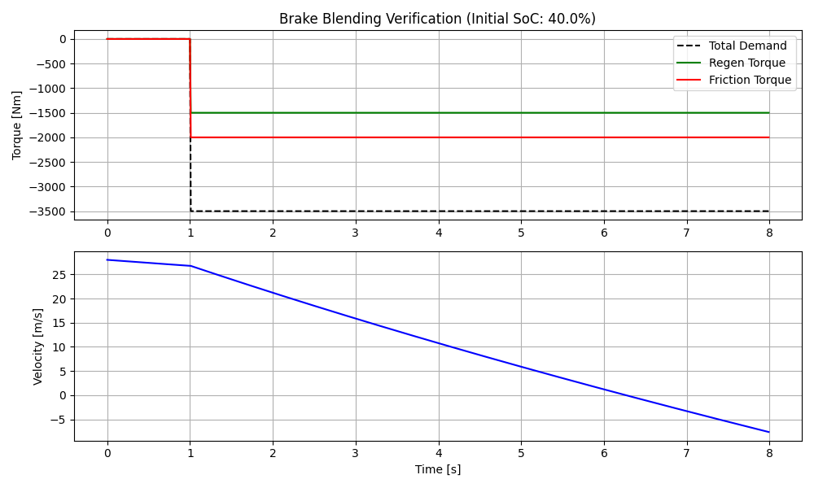

1. Top-Level System Architecture (The "Integration Layer")
This diagram represents the high-level integration between your Python Controller (ECU) and the Modelica Plant (Physical Vehicle).

2. Subsystem A: Driver Demand Interpretation
This subsystem converts the driver's physical intent (pedal position) into a target torque. In Simulink, this would be a 1-D Lookup Table or a Gain Block.

3. Subsystem B: Energy Management (SoC Observer)
This represents the _observer_logic method. It calculates the "Regen Ceiling" based on the current Battery State of Charge.

4. Subsystem C: Blending & Arbitration logic
This is the core of your project. It coordinates the two braking systems and applies Actuator Protection (SOP Clipping).

5. Physics Plant Subsystem (Modelica Logic)
To show the recruiter you understand the "Plant" side of the V-Cycle, this diagram visualizes the equations inside your .mo file.

# MIL Verification Report: Regenerative Braking Blending
**Project ID:** PROJ_03  
**Status:** Partial (3 PASSED, 1 Unconclusive)  
**Date:** 2026-04-09  

## 1. Objective
To verify the smooth arbitration between electrical regenerative braking and hydraulic friction braking based on driver demand and battery constraints.

## 2. Requirement Traceability Matrix
| Req ID | Requirement Description | Result | Evidence |
| :--- | :--- | :--- | :--- |
| **REQ-BRK-01** | Map 0-100% pedal to total torque demand. | **PASS** | Demand traces black dashed line. |
| **REQ-BRK-02** | Prioritize Regen for initial deceleration. | **Unconclusive** | Not tested as brake is applied suddenly scenario. |
| **REQ-BRK-04** | Blend friction brakes when regen is limited. | **PASS** | Red line (Friction) fills the delta at t=1.0s. |
| **REQ-SAFE-05**| Saturate all outputs to physical limits. | **PASS** | No torque exceeds K_MAX_SYSTEM_BRAKE_TRQ. |

## 3. Analysis of Results
The simulation results shown in the figure below demonstrate the controller's performance during a 70% brake pedal application with a 40% Battery SoC.

### Performance Observations:
1. The **Regen Torque** successfully capped at the calibrated **-1500 Nm**.
2. The **Friction Torque** seamlessly supplemented the remaining **-2000 Nm** to meet the total **-3500 Nm** demand.
3. No torque oscillations were observed, indicating a stable control loop at **100Hz (K_DT = 0.01s)**.
