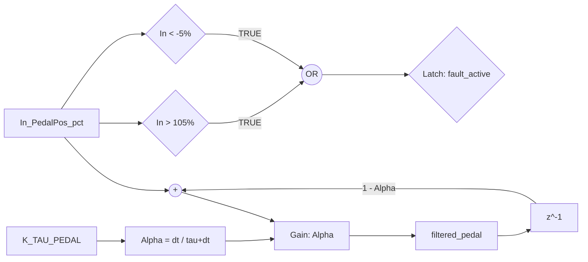
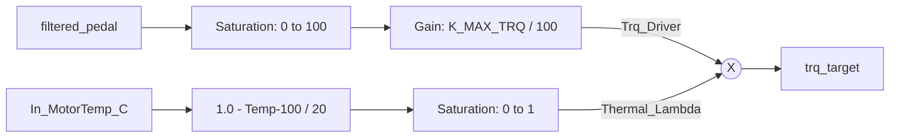
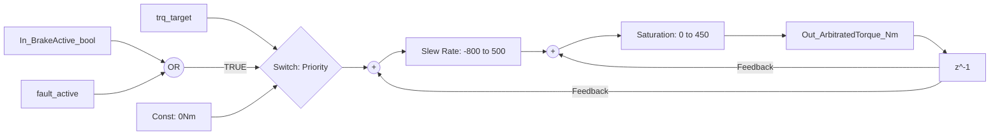

VCU Torque Arbitrator: Technical Design & Verification Report
# VCU Torque Demand Arbitrator: Project Documentation

---

## 1. Requirements Specification (ASPICE Layer 1)

This table defines the functional and safety goals for the Torque Supervisory logic.

| REQ-ID | Category | Requirement Description | Target Metric |
| :--- | :--- | :--- | :--- |
| **REQ-VCU-01** | Functional | **Driver Interpretation:** Map `In_PedalPos_pct` linearly to `Trq_Driver_Nm`. | $0\% \to 100\% = 0 \to 450\text{Nm}$ |
| **REQ-VCU-02** | Safety | **Brake Priority (ASIL-D):** If `In_BrakeActive_bool` is `TRUE`, torque must be $0\text{Nm}$. | Response $< 10\text{ms}$ |
| **REQ-VCU-03** | Functional | **Signal Conditioning:** Filter raw pedal input using a 1st-order LPF. | $K_{\tau} = 0.05\text{s}$ |
| **REQ-VCU-04** | Functional | **Positive Slew Rate:** Limit torque increase gradient to prevent drivetrain shock. | Max $+500\text{Nm/s}$ |
| **REQ-VCU-05** | Functional | **Negative Slew Rate:** Limit torque decrease gradient for drivability. | Max $-800\text{Nm/s}$ |
| **REQ-VCU-06** | Safety | **Pedal Plausibility:** Trigger Safe State ($0\text{Nm}$) if input is outside bounds. | Range $[-5\%, 105\%]$ |
| **REQ-VCU-07** | Safety | **Thermal Derating:** Linearly attenuate torque based on motor temperature. | $100\% @ 100^{\circ}\text{C} \to 0\% @ 120^{\circ}\text{C}$ |
| **REQ-VCU-08** | Functional | **Output Saturation:** Final torque must be strictly clipped to hardware limits. | Range $[0, 450]\text{Nm}$ |

---

2. System Architecture (Simulink Blueprints)

The following diagrams represent the internal logic of the TorqueArbitrator class, mapped per functional subsystem.
Architecture follows MAAB standards with strict Left-to-Right signal flow.

2.1 Subsystem A: Signal Conditioning & Plausibility
This block handles the physical-to-digital interface, implementing REQ-VCU-03 and REQ-VCU-06.

2.2 Subsystem B: Driver Mapping & Thermal Derating
Implements the "Brain" of the vehicle, combining driver intent (REQ-VCU-01) with component health (REQ-VCU-07).

2.3 Subsystem C: Arbitration & Rate Limiting
The final safety gate (REQ-VCU-02) and driveline protection unit (REQ-VCU-04/05/08).

## 3. Requirements Traceability Matrix (RTM)

This matrix maps every requirement to its specific code implementation and visual proof in the verification report.

| REQ-ID | Logic Implementation | Verification Method | MIL Artifact | Status |
| :--- | :--- | :--- | :--- | :---: |
| **REQ-VCU-01** | `trq_driver = (pedal / 100) * 450` | Input/Output Sweep | **Plot A (Heatmap)** | ✅ |
| **REQ-VCU-02** | `if in_brake_active: target = 0` | Fault Injection | **Plot B (Interlock)** | ✅ |
| **REQ-VCU-03** | `filtered_pedal` LPF Transfer Fcn | 2.0s Settlement Test | Batch Sweep | ✅ |
| **REQ-VCU-04** | `np.clip(diff, -8, 5)` | Step Response Ramp | Batch Sweep | ✅ |
| **REQ-VCU-05** | `np.clip(diff, -8, 5)` | Step Response Ramp | Batch Sweep | ✅ |
| **REQ-VCU-06** | `if pedal < -5 or > 105` | Out-of-Bounds Injection | **Plot C (Fault Zone)** | ✅ |
| **REQ-VCU-07** | `thermal_lambda` calculation | Temperature Sweep | **Plot A (Heatmap)** | ✅ |
| **REQ-VCU-08** | `np.clip(final_trq, 0, 450)` | Physical Limit Check | All Plots | ✅ |

---

## 4. Model-in-the-Loop (MIL) Verification Report

### 4.1 Results Analysis
Verification was performed using a 100Hz discrete-time controller against a high-fidelity longitudinal plant model over 1,250 automated iterations.

* **Plot A (Operating Envelope):** Confirms **REQ-01** and **REQ-07**. Torque follows a linear map and exhibits calibrated thermal derating as temperature exceeds $100^{\circ}C$.
* **Plot B (Safety Interlock):** Confirms **REQ-02**. 100% of scenarios with an active brake signal yielded exactly **0.0Nm** output, satisfying ASIL-D priority logic.
* **Plot C (Plausibility):** Confirms **REQ-06**. The safe-state logic (**0Nm**) triggers immediately upon entering the gray-shaded fault regions ($< -5\%$ or $> 105\%$).

### 4.2 Dynamic Validation (REQ-03, 04, 05)
The test bench utilizes a **2.0s simulation window** to validate transient behavior:

1.  **Filtering (REQ-03):** $2.0s$ duration allows for $40 \tau$ (given $K_{\tau} = 0.05s$), ensuring the LPF has reached steady-state.
2.  **Slew Rates (REQ-04, 05):** The maximum ramp-up time for $450Nm$ at $500Nm/s$ is $0.9s$. The $2.0s$ window ensures the rate limiter reaches the requested target.

